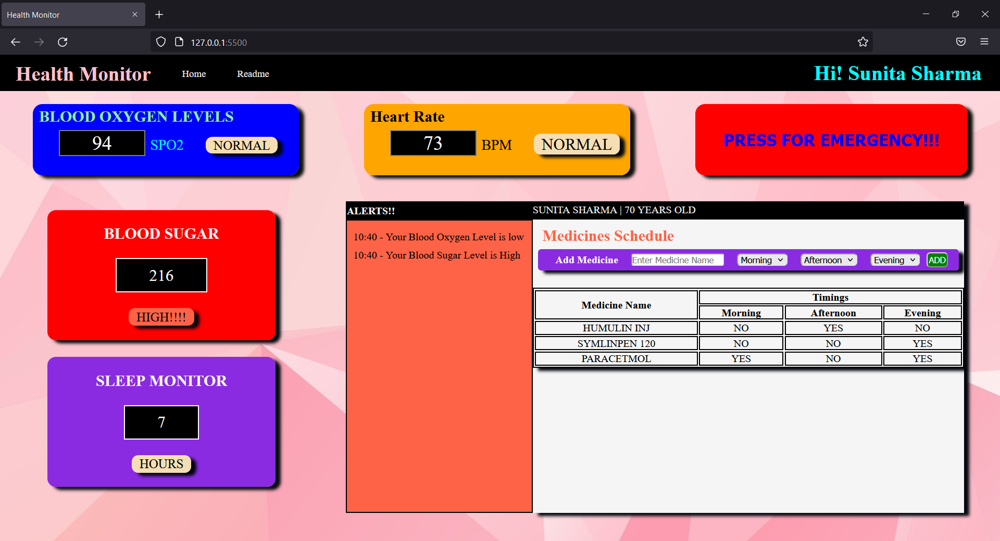

# HEALTH MONITOR
### LINK [Health-Monitor](https://siddharthshrivastava0.github.io/Health-Monitor)
---
## DESCRIPTION
Health Monitor is a prototype project for elderly to make them easy to monitor their health as well as any individual who wants to monitor their vitals like Blood Oxygen Levels, Heart Rate, Blood Sugar Levels, Sleep (From Wearable Devices as of now precoded using javascript with optimal values) and Medicine Schedule with an Emergency button which on clicking will alert ambulance with location also an alert system which shows alerts about your vitals when they are at abnormal levels and above some limit it triggers event as same as Emergency Button.Desktop and Mobile responsive design build with HTML,CSS and Javascript .

---
## SCREENSHOTS
### Home Page 
\

=========================================

### Alert and Medicine Schedule Section
\

=========================================
### Vitals Monitors
\

\

=========================================

---
## INSTALLATION
No Special Requirements \
Any Javascript Enabled Browser \
Optimal Resolutions : 1920 X 1080 and 1366 X 768 and Mobile Phones.

---
## USAGE
### Home Page
Elderly and individuals can monitor their vitals as well as their medicine schedule and alerts for their vitals abnormalites also an emergency button .
### Main Dashboard
* #### Medicine Schedule Section: People can add medicines to the schedule table and see according to which timings they have to take them morning,evening and night in medicine schedule table.
* #### Alert Section: People can see alerts about their vitals for monitors at home if they exceed or go below normal range.
### Emergency Button
If person feels unwell and thinks he/she needs medical attention then on clicking it will sent alert for an ambulance with location (Right now just an Alert).
### Heart Rate Monitor
It will show realtime Heart Rate from the data fetched by wearable devices in Beats Per Minute(BPM) (right now precoded).Also an alert system if which will alert ambulance if it exceeds 100 bpm or gets lower than 60 bpm.

### Blood Oxygen Level Monitor
It will show realtime Blood Oxygen Levels(SPO2) from the data fetched by wearable devices (right now precoded).Also an alert system if which will alert ambulance if it gets lower than 90.
### Blood Sugar Level Monitor
It will show realtime Blood Sugar Levels(mg/dl) from the data fetched by testing devices (right now precoded).Also an alert system if which will alert ambulance if it exceeds 220 mg/dl or gets lower than 90 mg/dl.
### Sleep Monitor
It will show realtime Sleep Time from the data fetched by wearable and display in Sleep Monitor.

---

## ROADMAP
* To add Wearable Device connectivity for body vitals monitoring 
* Login system with database for multiple login
* Improve design 
---
## AUTHOR AND ACKNOWLEGDMENT

Author : Siddharth Shrivastava \
Email: siddharthshrivastava1999@gmail.com \
LinkedIn: https://www.linkedin.com/in/siddharth-shrivastava-9265ab171 /
GitHub : https://github.com/siddharthshrivastava0 

---

## SUPPORT
For any support query please contact me at \
Email: siddharthshrivastava1999@gmail.com \

---
## PROJECT STATUS
Its an early prototype in development.

---

================================END==========================================

---

